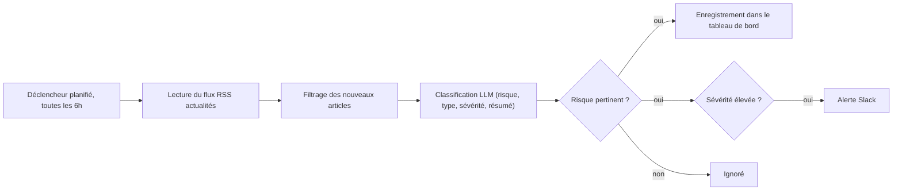

# Supply Chain Risk Watch

Agent d'automatisation construit avec n8n qui surveille l'actualité en continu pour détecter des événements susceptibles de perturber une chaîne d'approvisionnement (grèves portuaires, catastrophes naturelles, tensions géopolitiques, pénuries), les classe par sévérité à l'aide d'un LLM, et alerte les équipes concernées en temps réel.

## Contexte et objectif

Ce projet est né d'un retour de recruteur : construire une démonstration concrète d'automatisation de workflow, au delà des pipelines RAG et agents GenAI classiques déjà présents dans mon portfolio ([rag-evaluated-pipeline](https://github.com/Hajartbl/rag-evaluated-pipeline)). Il applique la même logique d'orchestration LLM à un problème métier issu de mon expérience en Oil & Gas chez SLB, où le suivi des risques d'approvisionnement est un enjeu opérationnel quotidien.

## Fonctionnement

Un déclencheur planifié interroge un flux d'actualités toutes les six heures. Les articles déjà traités sont écartés par un nœud de déduplication. Chaque article restant est envoyé à un modèle de langage qui détermine s'il s'agit d'un risque supply chain, en identifie le type (grève, catastrophe naturelle, tension géopolitique, pénurie), estime la sévérité et rédige un résumé en deux phrases. Les événements pertinents sont journalisés dans un tableau de bord Google Sheets, et ceux de sévérité élevée déclenchent une alerte Slack immédiate.

## Stack

n8n pour l'orchestration du workflow, un modèle LLM (GPT-4o-mini ou équivalent) pour la classification et le résumé, Google Sheets comme tableau de bord de suivi, Slack pour les alertes.

## Structure du repo

`workflow.json` contient l'export complet du workflow n8n, importable directement dans une instance n8n.

## Pour reproduire

Importer `workflow.json` dans n8n (Workflows puis Import from File). Configurer les identifiants pour le nœud OpenAI (ou tout autre fournisseur LLM compatible), le nœud Google Sheets (remplacer `REPLACE_WITH_GOOGLE_SHEET_ID` par l'identifiant de votre feuille) et le nœud Slack. Ajuster la requête RSS et les mots-clés de filtrage selon les fournisseurs ou zones géographiques à surveiller. Activer le workflow.

## Limites et pistes d'amélioration

La détection repose sur un seul flux d'actualités générique ; une version production croiserait plusieurs sources (météo, transport maritime, indicateurs macroéconomiques par pays). Le seuil de sévérité est actuellement fixe ; il pourrait être pondéré par fournisseur selon leur criticité réelle dans la chaîne d'approvisionnement.
